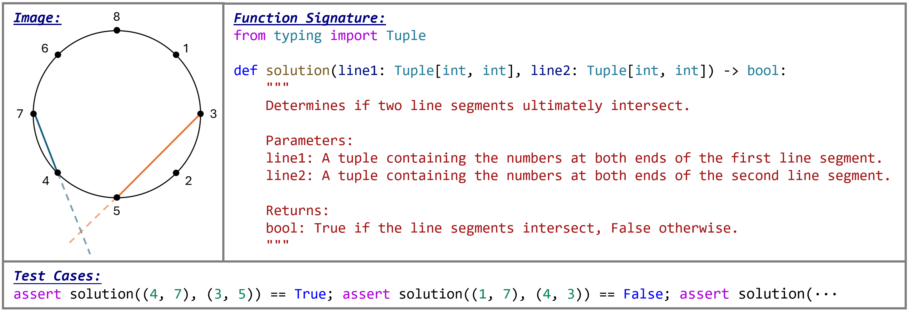

<h1 align="center">
 HumanEval-V Benchmark
</h1>

<p align="center"> <a href="https://arxiv.org/abs/2410.12381">📄 Paper</a> • <a href="https://humaneval-v.github.io">🏠 Home Page</a> • <a href="https://humaneval-v.github.io/#leaderboard">🏆 Leaderboard</a> • <a href="https://huggingface.co/datasets/HumanEval-V/HumanEval-V-Benchmark">🤗 Dataset</a> • <a href="https://huggingface.co/spaces/HumanEval-V/HumanEval-V-Benchmark-Viewer">🤗 Dataset Viewer</a>  </p>

Welcome to the official repository for the paper **"HumanEval-V: Evaluating Visual Understanding and Reasoning Abilities of Large Multimodal Models Through Coding Tasks"**.

## 🌟News
- **[2024.10.23]** **Claude 3.5 Sonnet (1022)** achieves **new SOTA** on HumanEval-V with **25.9** _pass@1_ and **42.6** _pass@10_
- **[2024.10.23]** We include more SOTA LMMs in the learderboard, including <a href="https://huggingface.co/mistralai/Pixtral-12B-2409">Pixtral</a>, <a href="https://huggingface.co/meta-llama/Llama-3.2-11B-Vision-Instruct">Llama-3.2-Vision</a>, <a href="https://huggingface.co/rhymes-ai/Aria">Aria</a>, and <a href="https://huggingface.co/AIDC-AI/Ovis1.6-Gemma2-9B">Ovis1.6-Gemma2</a>
- **[2024.10.23]** We've updated the <i>Parsing Success Rate</i> metric (passing <i>Pylint</i> without errors). Many LMMs perform poorly, indicating a decline in generating syntactically correct code.
- **[2024.10.17]** Our paper is now accessible at https://huggingface.co/papers/2410.12381 (**#2** Paper of the day)

## 👀Introduction
<h6 align="center">An example coding task from HumanEval-V. Each task involves completing a Python function<br> based on a single image, the function signature, and problem descriptions provided in the comment block.</h6>
<p align="center">

</p>

**HumanEval-V** is a novel and lightweight benchmark designed to evaluate the visual understanding and reasoning capabilities of Large Multimodal Models (LMMs) through coding tasks. The dataset comprises **108 entry-level Python programming challenges**, adapted from platforms like CodeForces and Stack Overflow. Each task includes **visual context that is indispensable to the problem**, requiring models to perceive, reason, and generate Python code solutions accordingly.

### Benchmark Components

Each coding task in HumanEval-V consists of **three main components**:

1. **Image**: A single image containing the essential visual context necessary to solve the task.
2. **Function Signature**: Includes the problem description, necessary imports, and the function signature that needs to be completed.
3. **Test Cases**: Used to execute and validate the correctness of the generated code.

The LMM must generate the complete function body given the image and function signature. **Below is the conversational prompt format used to prompt the LMMs**. The `{code_context}` is replaced with the function signature.

````markdown
**Instructions:**
You are an exceptionally intelligent coding assistant that consistently delivers accurate and reliable responses to user instructions.
Please complete the function based on the provided image and code context. Return the complete solution, including the function signature, in a single response, formatted within a Python code block.

**Code Context:**
```python
{code_context}
```
````

After the LMM generates a response, the solution is validated using the following process:
- Extract content within the markdown code block.
- Parse the generated code to detect imports, class definitions, and functions using an Abstract Syntax Tree (AST) parser.
- Concatenate these components to form the final predicted solution, which is then tested for correctness.
- Evaluate the generated code solution using the execution-based metric, _pass@k_.

## ⚡Quick Start
### 1. Environment Setup

- !!Ensure your environment has internet access to download our dataset from Hugging Face!!.
- We offer two sets of dependency requirements:
  - If you have your own model inference script and only need to run evaluations, prepare the model prediction file as per the pre-defined format.
  - If you want to try our provided model inference script, additional dependencies are required.

```bash
git clone https://github.com/HumanEval-V/HumanEval-V-Benchmark.git
cd HumanEval-V-Benchmark
```
```bash
conda create -n humanevalv python=3.10
conda activate humanevalv
```
```bash
pip install -r requirements.infer.txt  # For using our inference script
pip install -r requirements.txt        # For running only the evaluation with your own inference script
```

### 2. Run Model Inference
#### Option 1: Using Your Own Inference Script

If you have your own inference script, organize the model predictions in the following format (an example prediction file can be found in `output/example_pred_sample_20.json`):
```json
[
  {
    "qid": "XXX",
    "predictions": [
      "XXX",
      "XXX"
    ]
  }
]
```
- The prediction file should be a JSON file containing a list of dictionaries. Each dictionary should have the following fields:
  - **`qid`**: The identifier for each coding task in HumanEval-V (e.g., _q1_, _q1-2_).
  - **`predictions`**: A list of generated contents from the LMMs, excluding the input prompt.
- Hyperparameters for inference:
  - Use `temperature = 0.8` and `top-p = 0.95` to generate 20 samples for _pass@10_.
  - Use greedy decoding for _pass@1_.
- You may specify an end-of-sentence (EOS) token (`"\n```\n"`) to prevent generating excessive content. This EOS token stops generation at the closing of the markdown code block.


#### Option 2: Implementing Inference from Scratch

If you need to implement your own inference script, refer to the example script at `models/example.py`. You mainly need to implement the `query` method in the `LMM` class, which takes an image and textual prompt and generates predictions. We provide example implementations for **OpenAI GPT-4o-mini** and **vllm-based InternVL2-4B** in `models/openai_model.py` and `models/vllm_model.py`.

After implementing your model, run the following command:

```bash
python inference.py --model_name your_model_name --prediction_file output/your_lmm_sample_N.json --sample_num N --temperature T
```

This command will create a JSON file at `output/your_lmm_sample_N.json` for evaluation. Set `model_name` to the filename of your implemented LMM in the `models` directory.  Set `sample_num` to 1 (`temperature` to 0) for calculating _pass@1_ or to 20 (`temperature` to 0.8) for _pass@10_. 

An example command for running the GPT-4o-mini model is as follows:

```bash
# For generating a single sample for pass@1
python inference.py --model_name openai_model --prediction_file output/gpt_4o_mini_sample_1.json --sample_num 1 --temperature 0
# For generating 20 samples for pass@10
python inference.py --model_name openai_model --prediction_file output/gpt_4o_mini_sample_20.json --sample_num 20 --temperature 0.8
```

If you encounter interruptions during inference, you can simply rerun the inference script using the same prediction file path to resume generating predictions without overwriting the existing results.

### 3. Running Evaluation

After obtaining the model predictions in the specified format, run the evaluation as follows:

```bash
python evaluate.py --prediction_file output/your_lmm_sample_N.json
```

This command will execute the predictions using the test cases and calculate the _pass@k_ score, saving the results to `output/your_lmm_sample_N_executed.json`. For subsequent evaluations without re-executing code solutions, you can use:

```bash
python evaluate.py --prediction_file output/your_lmm_sample_N.json --score_only
```

## 💘Citation
```bibtex
@article{zhang2024humanevalv,
  title={HumanEval-V: Evaluating Visual Understanding and Reasoning Abilities of Large Multimodal Models Through Coding Tasks}, 
  author={Zhang, Fengji and Wu, Linquan and Bai, Huiyu and Lin, Guancheng and Li, Xiao and Yu, Xiao and Wang, Yue and Chen, Bei and Keung, Jacky},
  journal={arXiv preprint arXiv:2410.12381},
  year={2024},
}
```
