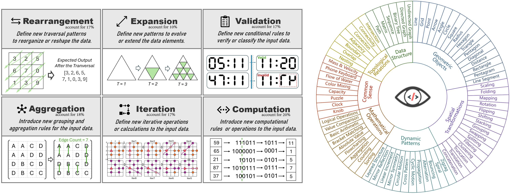
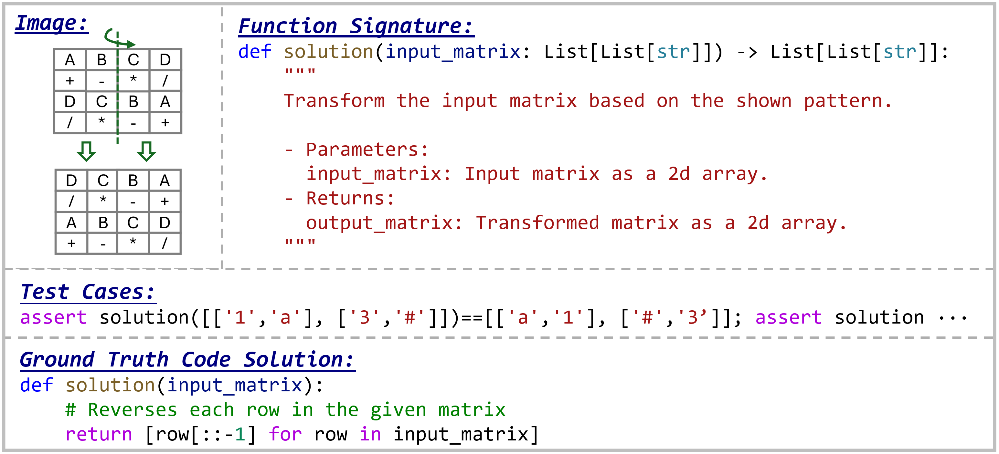
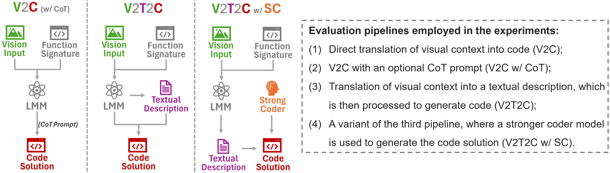

<h1 align="center">
 HumanEval-V Benchmark
</h1>

<p align="center"> <a href="https://arxiv.org/abs/2410.12381">📄 Paper</a> • <a href="https://humaneval-v.github.io">🏠 Home Page</a> • <a href="https://humaneval-v.github.io/#leaderboard">🏆 Leaderboard</a> • <a href="https://huggingface.co/datasets/HumanEval-V/HumanEval-V-Benchmark">🤗 Dataset</a> • <a href="https://huggingface.co/spaces/HumanEval-V/HumanEval-V-Benchmark-Viewer">🤗 Dataset Viewer</a>  </p>

Welcome to the official repository for **"HumanEval-V: Benchmarking High-Level Visual Reasoning
with Complex Diagrams in Coding Tasks"**.

## 👀Introduction
**HumanEval-V** is a novel benchmark designed to evaluate the ability of **Large Multimodal Models (LMMs)** to understand and reason over **complex diagrams** in programming contexts. Unlike traditional multimodal or coding benchmarks, **HumanEval-V** challenges models to generate **Python code** based on **visual inputs** that are **indispensable** for solving the task. Our dataset consists of **253 human-annotated coding tasks**, each requiring LMMs to **perceive, interpret, and reason** over diagrams to produce functionally correct code solutions.

### Why HumanEval-V?  

Despite recent advancements in **multimodal reasoning**, existing benchmarks focus primarily on **scientific**, **mathematical**, or **chart-based analysis**, assessing models' domain knowledge. These benchmarks don't fully challenge models to understand **complex diagrams** in the way that coding problems typically require.

**HumanEval-V** addresses this gap by introducing coding tasks where the **diagram alone** encodes most of the problem context. Models must perform advanced visual reasoning without relying on lengthy textual descriptions, pushing the boundaries of **vision reasoning** capabilities.

### Key Features

<p align="center">

</p>

- **Indispensable visual context**: Each task includes a self-contained diagram, eliminating reliance on detailed textual descriptions.  
- **Diverse and realistic problem types**: The dataset spans **six distinct categories**, covering a wide range of visual reasoning abilities.  
- **Code generation task**: Unlike many multimodal benchmarks, which rely on **MCQ or short-answer tasks**, HumanEval-V requires models to **generate executable code**, ensuring a more rigorous evaluation of diagram comprehension.  
- **Structured evaluation pipeline**: We introduce a **two-stage evaluation** approach where LMMs only need to generate a structured **diagram description**, which will be translated into code by a seperate strong coder model. This ensures that **visual understanding is explicitly assessed** rather than conflated with coding proficiency.  
- **Execution-based evaluation**: Solutions are tested using **handcrafted test cases** and scored with the **pass@k** metric, providing an objective measure of correctness.  

### Challenges for LMMs  

Through extensive experiments with **22 state-of-the-art LMMs**, we observe:  

- **Top-performing models** struggle, with **Claude 3.5 Sonnet** achieving only **36.8% pass@1**, while **Pixtral 124B** reaches **21.3% pass@1**.  
- LMMs perform better at **diagram description** than direct **code generation**, revealing a gap in their **vision-to-code** capabilities.  
- **Sampling** and **iterative refinement** improve results, with **Claude 3.5 Sonnet** reaching **74.3% pass@1** with 100 samples and **55.3% pass@1** with four self-refinement iterations.  
- Models struggle with tasks that are trivial for humans, especially in **spatial transformations**, **topological relationships**, and **dynamic patterns**.

## 💡 How It Works

<p align="center">

</p>

Each task in **HumanEval-V** includes:

1. **Diagram** – Encodes the problem context, requiring spatial or logical reasoning.  
2. **Function Signature** – Defines the required function, including input-output structure.  
3. **Test Cases** – Validate the correctness of the generated solution.

We use a structured **evaluation pipeline** to assess **visual reasoning** and **coding efficiency** separately, ensuring that models' abilities are evaluated in a decoupled manner.

<p align="center">

</p>

## ⚡Quick Start
### 1. Environment Setup
```bash
git clone https://github.com/HumanEval-V/HumanEval-V-Benchmark.git
cd HumanEval-V-Benchmark
```
```bash
conda create -n humanevalv python=3.12
conda activate humanevalv
pip install -r requirements.txt # For a test run using our example scripts
```

### 2. Run Inference and Evaluation

#### Prediction File Format

The prediction file should follow the format below. An example can be found in `output/example_pred_sample_6.json`:

```json
[
  {
    "qid": "XXX",
    "prompt": "XXX",
    "predictions": [
      "XXX",
      "XXX"
    ]
  }
]
```

Each entry in the JSON file should contain the following fields:
- **`qid`**: The unique identifier for each coding task (e.g., _q1_, _q1-2_).
- **`prompt`**: The input prompt provided to the model for inference.
- **`predictions`**: A list of model-generated outputs. The number of predictions will vary:
  - 1 for **pass@1**
  - 6 for **pass@3**

#### Implement Your LMM Model

To implement your own inference script, refer to the example script in `models/example.py`. The key methods to implement are:

- **`load_model`**: Load your multimodal model.
- **`query`**: Accept a diagram and prompt, then generate and return predictions.

An example implementation for **OpenAI GPT-4o** can be found in `models/gpt_4o.py`. (remember to put your own api key in line 38)

#### Choose Your Experiment Type

We provide the following experiment types for evaluating your model:

- **V2C**: **Vision-to-Code** – Generate code directly from the diagram.
- **V2C-CoT**: **Vision-to-Code with Chain-of-Thought (CoT)** – Generate code from the diagram with step-by-step reasoning (Chain-of-Thought) to guide the process.
- **V2T2C**: **Vision-to-Text-to-Code** – First, generate a structured description of the diagram, then use the description (without the diagram) to generate the code.
- **V2T2C-4o**: **Vision-to-Text-to-Code with GPT-4o** – Similar to **V2T2C**, but use GPT-4o to generate the code from the generated diagram description (without the diagram).
- **GT-T2C**: **Ground-Truth Text-to-Code** – Generate code directly using the human-annotated ground truth diagram description, testing the model's coding efficiency without visual reasoning.

#### Run Evaluation

To run and evaluate the model, use the following script (`run_evaluation.sh`):

```bash
exp_base_dir="output/example_exp"

model_names=("gpt_4o")
exp_types=("V2C" "V2C-CoT" "V2T2C" "V2T2C-4o" "GT-T2C")
sample_num=(1 6)

for model_name in "${model_names[@]}"; do
    for exp_type in "${exp_types[@]}"; do
        for num in "${sample_num[@]}"; do
            echo "Running experiment with model: $model_name, type: $exp_type, samples: $num"
            python inference.py --model_name $model_name --exp_type $exp_type --sample_num $num --exp_base_dir $exp_base_dir
            python evaluate.py --model_name $model_name --exp_type $exp_type --sample_num $num --exp_base_dir $exp_base_dir
        done
    done
done
```

Simply execute the following command to start the evaluation:

```bash
bash run_evaluation.sh
```

This will:

1. Run inference and save the results to `output/example_exp/{model_name}_{task_type}_sample_{sample_num}.json`.
2. Perform evaluation using test cases and save the execution results to `output/example_exp/{model_name}_{task_type}_sample_{sample_num}_executed.json`.

#### Example Output

The evaluation results will include the following details:

```json
{
  "scores": {"pass@1/3": XX},
  "parse_success_rate": XX
}
```

- **`pass@1/3`**: Indicates the pass rate at either **pass@1** or **pass@3**, depending on the configuration.
- **`parse_success_rate`**: The percentage of successful code parsing, validated using **Pylint** syntax checking.

## 💘Citation
```bibtex
@article{zhang2024humanevalv,
  title={HumanEval-V: Benchmarking High-Level Visual Reasoning with Complex Diagrams in Coding Tasks}, 
  author={Zhang, Fengji and Wu, Linquan and Bai, Huiyu and Lin, Guancheng and Li, Xiao and Yu, Xiao and Wang, Yue and Chen, Bei and Keung, Jacky},
  journal={arXiv preprint arXiv:2410.12381},
  year={2024},
}
```
